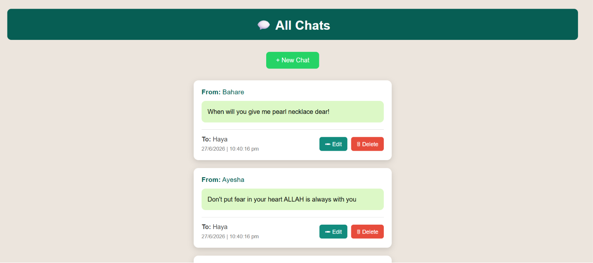
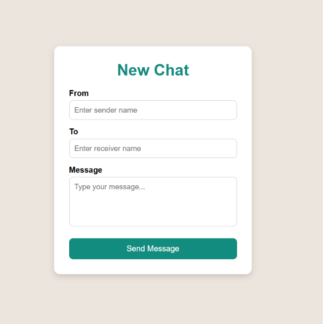
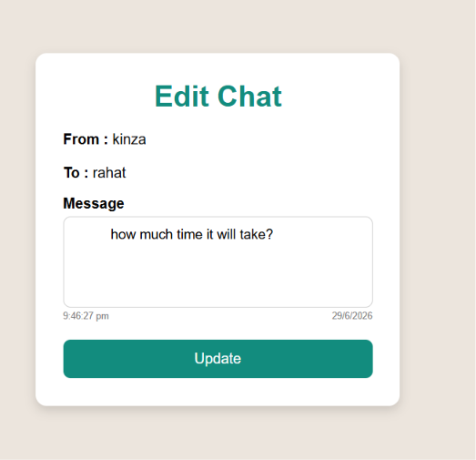
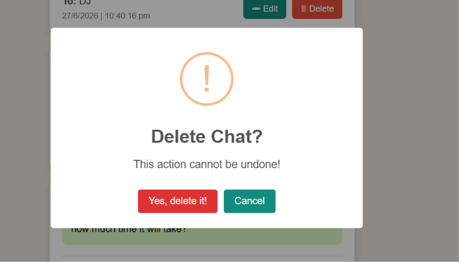

# 💬 WhatsApp Chat CRUD Application

A simple WhatsApp-inspired chat management application built using **Node.js**, **Express.js**, **MongoDB**, **Mongoose**, and **EJS**. This project demonstrates CRUD (Create, Read, Update, Delete) operations with a clean and responsive user interface.

---

## 📸 Screenshots

### 🏠 Home Page



### ➕ New Chat



### ✏️ Edit Chat



### 🗑️ Delete Chat

## 

## ✨ Features

- 📄 View all chats
- ➕ Create a new chat
- ✏️ Edit existing chats
- 🗑️ Delete chats
- 📅 Display message date and time
- 💬 WhatsApp-inspired UI
- ✔️ Form validation using Mongoose
- 🌐 RESTful routes using Express

---

## 🛠️ Tech Stack

- Node.js
- Express.js
- MongoDB
- Mongoose
- EJS
- HTML5
- CSS3
- JavaScript

---

## 📂 Project Structure

```text
Mongo-2/
│
├── models/
│   └── chat.js
│
├── public/
│   ├── index.css
│   └── app.js
│
├── views/
│   ├── index.ejs
│   ├── new.ejs
│   └── edit.ejs
│
├── init/
│   └── data.js
│
├── index.js
├── package.json
├── package-lock.json
├── .gitignore
└── README.md
```

---

## 📌 CRUD Operations

| Method | Route             | Description        |
| ------ | ----------------- | ------------------ |
| GET    | `/chats`          | Display all chats  |
| GET    | `/chats/new`      | Show new chat form |
| POST   | `/chats`          | Create a new chat  |
| GET    | `/chats/:id/edit` | Show edit form     |
| PATCH  | `/chats/:id`      | Update a chat      |
| DELETE | `/chats/:id`      | Delete a chat      |

---

## 📦 Dependencies

- express
- ejs
- mongoose
- method-override
- path

Install manually if needed:

```bash
npm install express ejs mongoose method-override
```

---

## 📖 What I Learned

Through this project, I practiced:

- Express.js routing
- RESTful APIs
- CRUD operations
- MongoDB integration with Mongoose
- EJS templating
- Method Override
- Serving static files
- Form handling
- Data validation
- Responsive UI design

---

## 🔮 Future Improvements

- User authentication
- Login & Signup
- Search chats
- Pagination
- Profile pictures
- Real-time messaging with Socket.IO
- SweetAlert2 confirmation dialogs
- Dark mode

---

## 👩‍💻 Author

**Uzma Noorulain**

---

## 📜 License

This project is licensed under the MIT License.

Feel free to use, modify, and learn from this project.
